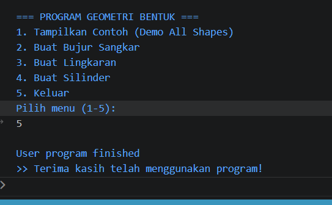

Tugas PBO - Inheritance dan Polymorphism

NIM: F1D02510031
Nama: Abrisam Satria Nuryono

Kelas: PBO - 5 Inheritance dan Polymorphism

Deskripsi Program

# Tugas Praktikum PBO: Implementasi Inheritance dan Polymorphism

Proyek ini dibuat untuk memenuhi tugas mata kuliah Pemrograman Berbasis Objek (PBO) yang mengimplementasikan struktur hirarki geometri bangun datar dan bangun ruang menggunakan bahasa pemrograman **Java**.

---

## 📌 Penerapan Konsep OOP pada Kode

### 1. Inheritance (Pewarisan)
* **Penerapan**: Menggunakan kata kunci `extends` untuk mewariskan atribut dan method dari kelas induk (*superclass*) ke kelas anak (*subclass*).
* **Hirarki Pewarisan**:
  * `BujurSangkar` mewarisi kelas `Bentuk` (mendapatkan atribut `warna`).
  * `Lingkaran` mewarisi kelas `Bentuk` (mendapatkan atribut `warna`).
  * `Silinder` mewarisi kelas `Lingkaran` (mendapatkan atribut `warna`, `radius`, serta method `hitungLuas()`).

### 2. Polymorphism (Polimorfisme)
* **Penerapan**: Menggunakan **Method Overriding** (`@Override`) di mana subclass mendefinisikan ulang perilaku method `printInfo()` sesuai spesifikasi bentuk masing-masing.
* **Perilaku Output**:
  * `Bentuk.printInfo()`      → Menampilkan warna bentuk.
  * `BujurSangkar.printInfo()`→ Menampilkan warna dan hasil `hitungLuas()` bujur sangkar.
  * `Lingkaran.printInfo()`   → Menampilkan warna dan hasil `hitungLuas()` lingkaran.
  * `Silinder.printInfo()`    → Menampilkan warna dan hasil `hitungVolume()` silinder.

---

## 📸 Screenshot Output Program

| Menu / Fitur | Screenshot Output |
| :--- | :--- |
| **1. Demo Otomatis (All Shapes)** |  |
| **2. Buat Bujur Sangkar** |  |
| **3. Buat Lingkaran** |  |
| **4. Buat Silinder** |  |
| **5. Keluar Program** |  |

---

## 📁 Struktur File Repositori

```text
src/
├── Bentuk.java        # Superclass utama
├── BujurSangkar.java  # Subclass dari Bentuk
├── Lingkaran.java     # Subclass dari Bentuk
├── Silinder.java      # Subclass dari Lingkaran
└── Main.java          # Program utama dengan menu interaktif
```